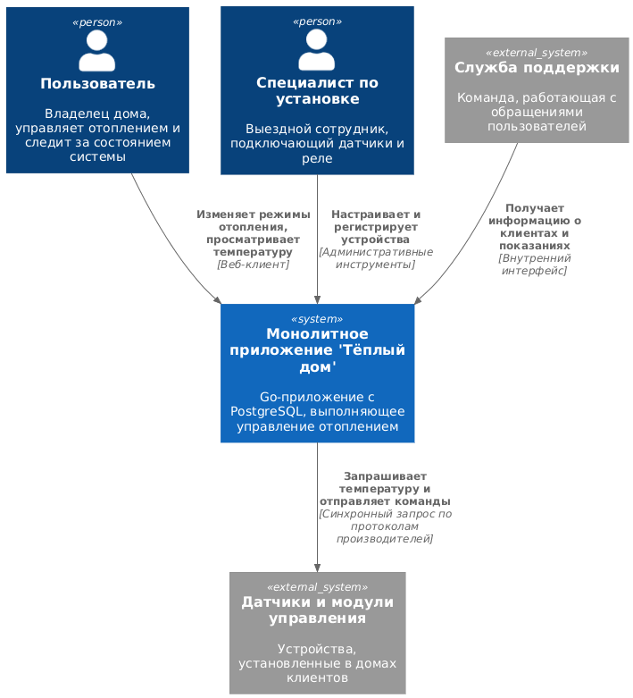
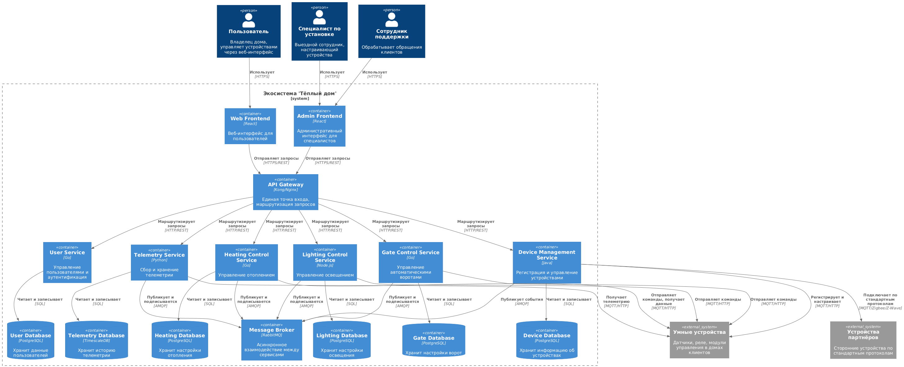
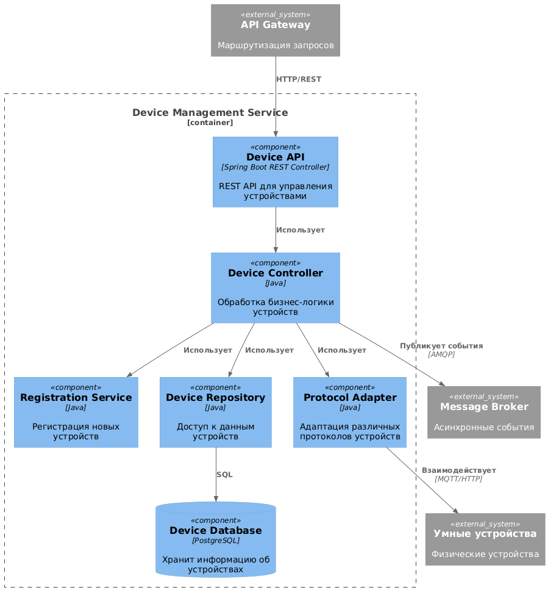
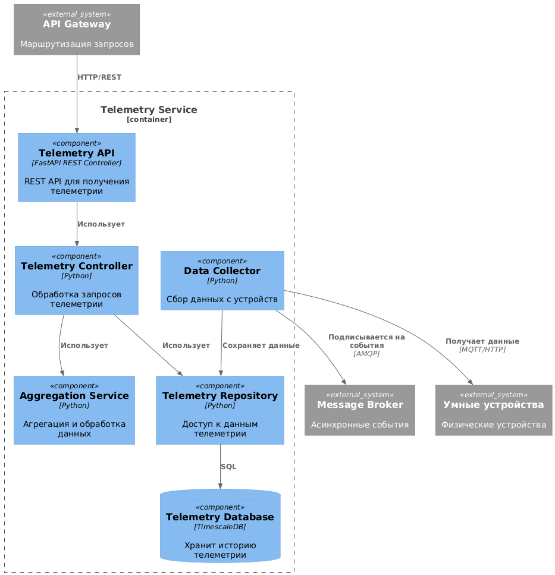
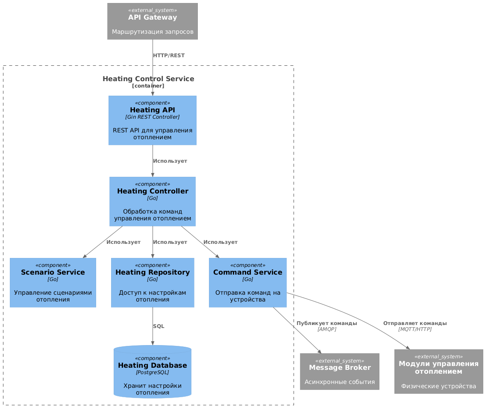
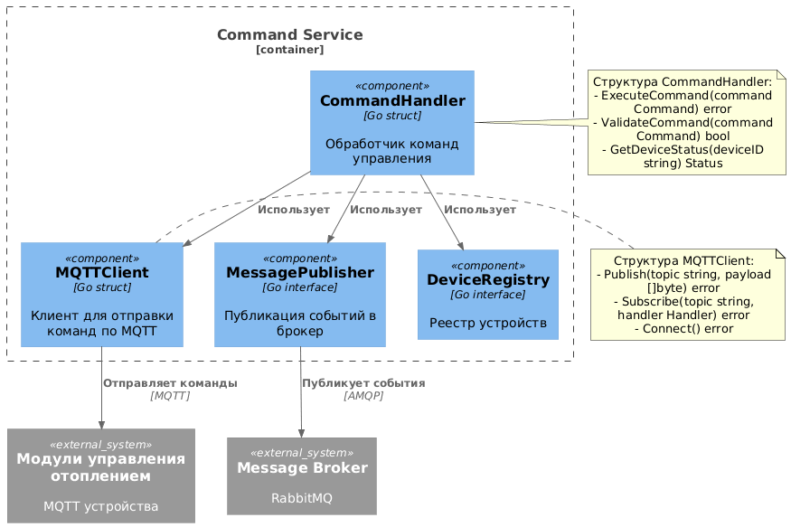
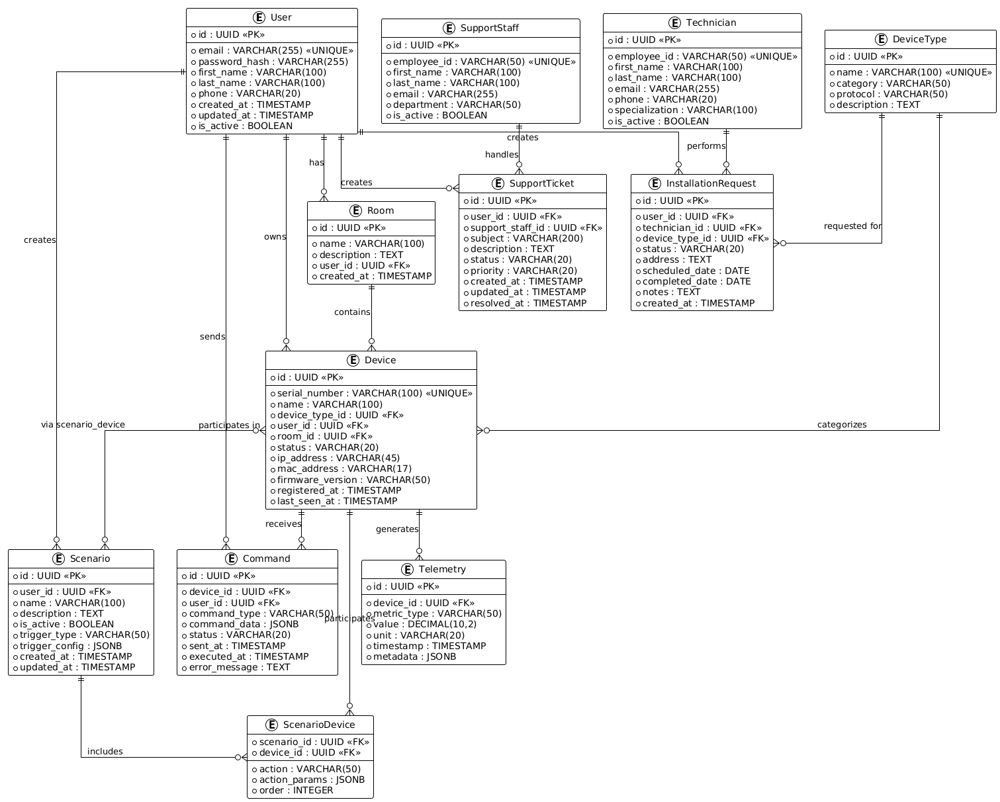

# Project_template

Это шаблон для решения проектной работы. Структура этого файла повторяет структуру заданий. Заполняйте его по мере работы над решением.

# Задание 1. Анализ и планирование
### 1. Описание функциональности монолитного приложения

**Управление отоплением:**

- Владельцы домов удалённо меняют режимы отопления через веб-клиент.
- Приложение отправляет команды на модули управления котлом и контролирует успешность выполнения.
- Все операции проходят через единый сервер, который последовательно обрабатывает пользовательские запросы.

**Мониторинг температуры:**

- Пользователи просматривают актуальные показания температуры с подключённых датчиков.
- Система при обращении к прибору получает данные и отображает их в интерфейсе.
- История измерений хранится в базе данных PostgreSQL и доступна сотрудникам поддержки.

**Инсталляция и сервисное обслуживание:**

- Подключение датчиков выполняет выездной специалист компании.
- Специалист привязывает устройство к аккаунту клиента внутри монолита и проводит первичную настройку.
- Все изменения конфигурации фиксируются сервисной командой через административный интерфейс.

### 2. Анализ архитектуры монолитного приложения

Язык программирования: Go

База данных: PostgreSQL

Архитектура: Монолитная, все компоненты системы (обработка запросов, бизнес-логика, работа с данными) находятся в рамках одного приложения.

Взаимодействие: Синхронное, запросы обрабатываются последовательно.

Масштабируемость: Ограничена, так как монолит сложно масштабировать по частям.

Развертывание: Требует остановки всего приложения.

### 3. Определение доменов и границы контекстов

`Управление отоплением`
- Контекст: операции по включению, выключению и настройке режимов работы отопительных модулей.
- Основные сущности: котёл, модуль управления, сценарий отопления, пользовательский профиль.

`Мониторинг телеметрии`
- Контекст: сбор и отображение текущих показаний температуры, хранение истории измерений.
- Основные сущности: датчик температуры, показание, комната, журнал измерений.

`Подключение и обслуживание устройств`
- Контекст: установка оборудования, привязка устройств к аккаунту клиента, техническое обслуживание.
- Основные сущности: заявка на установку, специалист, устройство, акт подключения.

`Поддержка клиентов`
- Контекст: обработка обращений пользователей, консультирование по работе системы, контроль SLA.
- Основные сущности: обращение клиента, статус, сотрудник поддержки, база знаний.

### **4. Проблемы монолитного решения**

- Выезд специалиста — единственный способ подключить новое устройство, пользователи не могут делать это самостоятельно.
- Любые изменения требуют развёртывания всего монолита, что вызывает простои и усложняет релизы.
- Синхронная обработка запросов приводит к задержкам при обращении к датчикам и снижает отказоустойчивость.
- Система не поддерживает подключение сторонних устройств по стандартным протоколам без доработки ядра.
- Масштабирование возможно только вертикально, что ограничивает рост числа пользователей и устройств.
- Команды разработки, QA и поддержки работают с одной кодовой базой и общим циклом релизов, что замедляет внедрение новых функций.

### 5. Визуализация контекста системы — диаграмма С4

Диаграмма в формате plantUML:
[c4_context_as_is.puml](schemas/c4_context_as_is.puml)

# Задание 2. Проектирование микросервисной архитектуры

В этом задании представлены  диаграммы в модели C4:
- Контейнерная диаграмма целевого решения
- Диаграммы компонентов Device Management Service
- Диаграммы компонентов Telemetry Service
- Диаграммы компонентов Heating Control Service
- Диаграмма кода Heating Control Service - Command Service Component

**Диаграмма контейнеров (Containers)**

Диаграмма в формате plantUML:
[c4_container_to_be.puml](schemas/c4_container_to_be.puml)

**Диаграммы компонентов (Components)**

**Device Management Service:**

Диаграмма в формате plantUML:
[c4_component_device_management_service.puml](schemas/c4_component_device_management_service.puml)

**Telemetry Service:**

Диаграмма в формате plantUML:
[c4_component_telemetry_service.puml](schemas/c4_component_telemetry_service.puml)

**Heating Control Service:**

Диаграмма в формате plantUML:
[c4_component_heating_control_service.puml](schemas/c4_component_heating_control_service.puml)

**Диаграмма кода (Code)**

**Пример: Heating Control Service - Command Service Component**

Диаграмма в формате plantUML:
[c4_code_command_service_component.puml](schemas/c4_code_command_service_component.puml)

# Задание 3. Разработка ER-диаграммы

ER-диаграмма отражает ключевые сущности системы, их атрибуты и типы связей между ними.

Созданная ER-диаграмма включает основные сущности:
- User — пользователи системы (владельцы домов)
- Room — комнаты в домах пользователей
- DeviceType — типы устройств (отопление, освещение, ворота, датчики)
- Device — устройства, подключённые к системе
- Telemetry — телеметрические данные с устройств
- Scenario — сценарии автоматизации
- ScenarioDevice — связующая таблица для связи сценариев и устройств (N:M)
- Command — команды управления устройствами
- Technician — специалисты по установке
- InstallationRequest — заявки на установку устройств
- SupportStaff — сотрудники службы поддержки
- SupportTicket — обращения в поддержку

Диаграмма отражает домены из Задания 1 и соответствует микросервисной архитектуре. 
Все сущности содержат атрибуты с типами данных и ограничениями (PK, FK, UNIQUE).

Диаграмма в формате plantUML:
[er-diagram.puml](schemas/er-diagram.puml)

# Задание 4. Создание и документирование API

### 1. Тип API

Для взаимодействия микросервисов в экосистеме "Тёплый дом" используется гибридный подход, сочетающий два типа API:

**REST API (OpenAPI 3.0) для синхронного взаимодействия:**
- Используется для запросов от клиентских приложений (Web Frontend, Admin Frontend) через API Gateway к микросервисам
- Применяется для операций, требующих немедленного ответа: получение данных, управление устройствами, аутентификация
- Преимущества: простота интеграции, широкое распространение, хорошая поддержка инструментами, возможность кэширования
- Все REST API документируются в формате OpenAPI 3.0 для автоматической генерации клиентов и интерактивной документации

**Асинхронное взаимодействие через Message Broker (AsyncAPI):**
- Используется для событийно-ориентированной коммуникации между микросервисами через RabbitMQ
- Применяется для: публикации событий о регистрации устройств, получения телеметрии, выполнения команд, уведомлений
- Преимущества: развязка сервисов, масштабируемость, отказоустойчивость, возможность обработки пиковых нагрузок
- Все асинхронные события документируются в формате AsyncAPI 2.0

**Обоснование выбора:**
1. **Разделение ответственности**: Синхронные запросы пользователей обрабатываются через REST API, а внутренние события между сервисами — асинхронно
2. **Производительность**: Асинхронная обработка телеметрии и команд позволяет системе справляться с большими нагрузками без блокировки
3. **Отказоустойчивость**: При недоступности одного сервиса события накапливаются в очереди и обрабатываются после восстановления
4. **Масштабируемость**: Каждый тип взаимодействия может масштабироваться независимо
5. **Стандартизация**: Использование OpenAPI и AsyncAPI обеспечивает единообразие документации и упрощает интеграцию

### 2. Документация API

Документация API для всех микросервисов представлена в формате OpenAPI 3.0 и AsyncAPI 2.0:

**REST API (OpenAPI 3.0):**

- **User Service API** — управление пользователями и аутентификация
  - [openapi-user-service.yaml](schemas/openapi-user-service.yaml)
  - Интерактивная документация: `/api/v1/users/docs` (Swagger UI)

- **Device Management Service API** — регистрация и управление устройствами
  - [openapi-device-service.yaml](schemas/openapi-device-service.yaml)
  - Интерактивная документация: `/api/v1/devices/docs` (Swagger UI)

- **Telemetry Service API** — получение телеметрических данных
  - [openapi-telemetry-service.yaml](schemas/openapi-telemetry-service.yaml)
  - Интерактивная документация: `/api/v1/telemetry/docs` (Swagger UI)

- **Heating Control Service API** — управление отоплением
  - [openapi-heating-service.yaml](schemas/openapi-heating-service.yaml)
  - Интерактивная документация: `/api/v1/heating/docs` (Swagger UI)

- **Lighting Control Service API** — управление освещением
  - [openapi-lighting-service.yaml](schemas/openapi-lighting-service.yaml)
  - Интерактивная документация: `/api/v1/lighting/docs` (Swagger UI)

- **Gate Control Service API** — управление автоматическими воротами
  - [openapi-gate-service.yaml](schemas/openapi-gate-service.yaml)
  - Интерактивная документация: `/api/v1/gates/docs` (Swagger UI)

**Асинхронные события (AsyncAPI 2.0):**

- **Message Broker Events** — события системы через RabbitMQ
  - [asyncapi-events.yaml](schemas/asyncapi-events.yaml)
  - Описывает все события, публикуемые и потребляемые микросервисами

Все спецификации представленные выше соответствуют стандартам OpenAPI 3.0 и AsyncAPI 2.0.

# Задание 5. Работа с docker и docker-compose

1. Создано Python приложение temperature-api.
- Создан файл apps/temperature-api/app.py с эндпоинтом /temperature, который возвращает случайное значение температуры (18-25°C)
- Реализована логика маппинга между location (Living Room, Bedroom, Kitchen) и sensorId (1, 2, 3)

2. Приложение упаковано в Docker

3. Обновлен docker-compose.yml

# **Задание 6. Разработка MVP**

Разработаны несколько новых микросервисов на стеке Python/Flask и Javascript/Express и обеспечена их интеграция с существующим монолитом для плавного перехода к микросервисной архитектуре. 

### **Реализация**

#### **Созданные микросервисы**

1. **Device Management Service** (Python/Flask)
   - Расположение: `apps/microservices/device-management-service/`
   - Порт: 8082
   - Функциональность:
     - Регистрация устройств
     - Получение списка устройств
     - Получение информации об устройстве
     - Обновление устройства
     - Удаление устройства
     - Получение статуса устройства
     - Получение типов устройств

2. **Telemetry Service** (Node.js/Express)
   - Расположение: `apps/microservices/telemetry-service/`
   - Порт: 8083
   - Функциональность:
     - Получение последних показаний устройства
     - Получение истории показаний
     - Получение показаний по комнате
     - Получение агрегированной статистики
     - Внутренний endpoint для приема телеметрии

#### **Принципы взаимодействия**

**1. Синхронное взаимодействие через REST API:**
   - Монолит и клиентские приложения взаимодействуют с микросервисами через HTTP REST API
   - Монолит может вызывать микросервисы напрямую для получения данных или выполнения операций
   - Пример: Монолит вызывает Device Management Service для регистрации нового датчика

**2. Асинхронное взаимодействие через RabbitMQ:**
   - Микросервисы публикуют события в RabbitMQ при выполнении операций
   - Другие микросервисы подписываются на интересующие их события
   - Примеры событий:
     - `device.registered` - публикуется Device Management Service при регистрации устройства
     - `telemetry.received` - публикуется Telemetry Service при получении телеметрии
   - Преимущества: развязка сервисов, отказоустойчивость, масштабируемость

**3. Постепенная миграция функциональности:**
   - Монолит продолжает работать с существующей логикой
   - Новые функции реализуются в микросервисах
   - Монолит может постепенно делегировать операции микросервисам
   - Пример: Вместо создания датчика в БД монолита, монолит вызывает Device Management Service

**4. Интеграция с существующим монолитом:**
   - Монолит получает переменные окружения для URL микросервисов:
     - `DEVICE_MANAGEMENT_SERVICE_URL` - адрес Device Management Service
     - `TELEMETRY_SERVICE_URL` - адрес Telemetry Service
   - Монолит может вызывать микросервисы для расширения функциональности
   - Монолит может отправлять телеметрию в Telemetry Service через внутренний endpoint